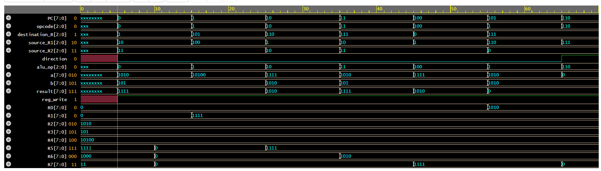

# Program Simulation and Verification

## Objective

The program-level simulation verifies the integrated operation of the custom 8-bit RISC processor. Instead of testing individual RTL blocks independently, a sequence of instructions is loaded into instruction memory and executed through the complete CPU datapath.

The simulation verifies instruction fetch, decoding, register access, ALU execution, and register write-back.

## Test Configuration

The processor is initialized with known register values to produce deterministic results.

| Register | Initial Value |
|---|---:|
| R2 | 10 |
| R3 | 5 |
| R4 | 20 |

The test program uses these values to exercise the implemented arithmetic and logical instructions.

## Test Program

| PC | Instruction | Expected Result |
|---:|---|---|
| 0 | ADD R1, R2, R3 | R1 = 15 |
| 1 | SUB R5, R4, R3 | R5 = 15 |
| 2 | AND R6, R1, R2 | R6 = 10 |
| 3 | OR R7, R2, R3 | R7 = 15 |
| 4 | XOR R0, R1, R3 | R0 = 10 |

## Instruction Encoding

Each instruction follows the 13-bit format:

| Opcode | RD | RS1 | RS2 | D |
|---|---|---|---|---|
| 3 bits | 3 bits | 3 bits | 3 bits | 1 bit |

The instructions are converted into their corresponding 13-bit binary representations and loaded into the instruction memory at the addresses specified by the program counter.

| PC | Instruction | Binary Encoding |
|---:|---|---|
| 0 | ADD R1, R2, R3 | 000 001 010 011 0 |
| 1 | SUB R5, R4, R3 | 001 101 100 011 0 |
| 2 | AND R6, R1, R2 | 010 110 001 010 0 |
| 3 | OR R7, R2, R3 | 011 111 010 011 0 |
| 4 | XOR R0, R1, R3 | 100 000 001 011 0 |

## Simulation Setup

The program simulation testbench:

1. Generates the processor clock.
2. Applies the reset signal.
3. Initializes the required register values.
4. Loads the encoded instructions into instruction memory.
5. Runs the processor for the required number of clock cycles.
6. Generates a VCD waveform for signal analysis.

The simulation is performed using EDA Playground and the resulting waveform is viewed using EPWave.

## Signals Observed

The following signals are monitored during simulation:

- Program Counter
- Instruction
- Opcode
- Destination Register
- Source Register 1
- Source Register 2
- Direction
- ALU Operation
- ALU Operands
- ALU Result
- Register Write Enable
- Register Values

These signals allow each instruction to be traced through the processor datapath.

## Expected Execution

For example, the first instruction is:

ADD R1, R2, R3

With:

R2 = 10  
R3 = 5

the register file supplies the two operands to the ALU. The control unit selects the ADD operation, producing:

R1 = 10 + 5 = 15

The result is written to R1 when the register-write signal is asserted.

The remaining instructions are verified similarly against their expected register values.

## Waveform Verification

The waveform is used to verify the relationship between the instruction being executed and the resulting datapath activity.

A correct execution should show:

Instruction Fetch → Instruction Decode → Register Read → ALU Execution → Register Write-Back

The waveform screenshot below will show the processor executing the test program and the corresponding changes in the datapath and register values.

## Verification Result

The program-level simulation verifies the functional integration of the processor modules and demonstrates correct execution of the selected instruction sequence.

The final waveform provides evidence of correct instruction sequencing, control generation, operand selection, ALU operation, and register write-back.
